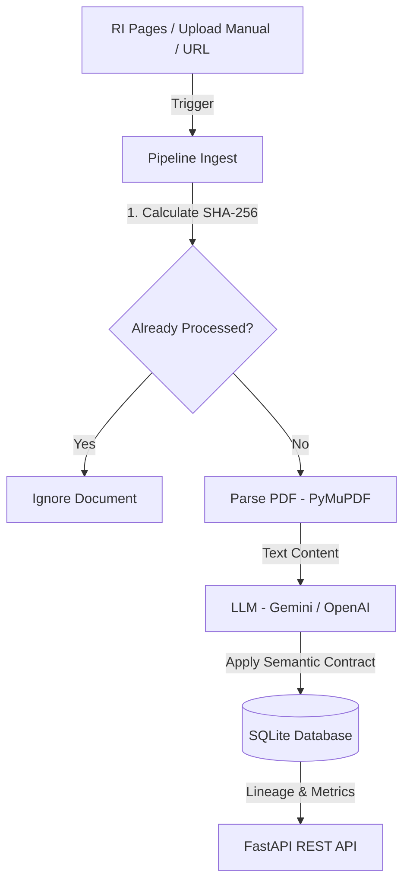

# Especificação do Desafio Prático: Pipeline de UDA (Unstructured Data Analysis)

## Introdução e Contextualização
Estudos de mercado apontam que 80% a 90% dos dados gerados globalmente são não estruturados (relatórios, contratos, PDFs, imagens). No entanto, tomar decisões estratégicas exige dados estruturados (tabelas, métricas, séries temporais). O processo de transformar esses grandes volumes de texto livre em bancos de dados relacionais consultáveis é conhecido como Análise de Dados Não Estruturados (UDA).

No cenário governamental, o Ministério das Cidades enfrenta o desafio de produzir periodicamente um Relatório de Conjuntura do Setor Habitacional. Este relatório depende da consolidação de dados operacionais e de mercado das principais construtoras do país, informações estas que ficam pulverizadas em relatórios e prévias operacionais em PDF publicados trimestralmente nos sites de Relações com Investidores (RI) de cada empresa.

## O Desafio
O objetivo é projetar e implementar um Pipeline de Engenharia e Análise de Dados Inteligente focado no setor corporativo habitacional, capaz de:
- Coletar os relatórios/prévias operacionais em PDF diretamente das Centrais de Resultados (RI) das incorporadoras. Extrair de forma automatizada, ou seja ficar observando e sempre que tiver um relatório novo já coletar e processar.
- Processar e Extrair as informações sob uma ótica semântica utilizando LLMs.
- Servir esses dados integrados por meio de uma API estruturada para alimentar o Relatório de Conjuntura.

O diferencial deste desafio é a resiliência da arquitetura: o pipeline não deve depender de regras rígidas de layout (como coordenadas fixas de PDF), mas sim da compreensão do contexto pela IA, permitindo que o mesmo script funcione mesmo se as empresas mudarem o design de seus relatórios ou tentarem mascarar resultados negativos destacando métricas convenientes.

### Escopo Técnico: O Que Fazer?

#### A. Extração Automatizada e Contínua (Orientada a Eventos)

O pipeline não deve ser uma ferramenta de execução manual e isolada. Logo o pipeline deve possuir arquitetura capaz de observar de forma contínua as fontes de dados (Centrais de Resultados/RI das empresas). Sempre que um novo relatório ou prévia operacional em PDF for detectado, o sistema deve disparar o fluxo de ingestão de forma automatizada.

Para atender a este requisito, a arquitetura proposta pelos alunos deve resolver dois problemas fundamentais:

##### 1. Gatilho de Ingestão (Ingestion Trigger)

Propor uma estratégia para detectar novos arquivos sem sobrecarregar os servidores das empresas. Eles podem escolher entre:
- Políticas de Agendamento (Polling/CronJobs): Scripts agendados que varrem as páginas de RI das construtoras em intervalos definidos (ex: uma vez por dia) buscando novos links de PDF.
- Gatilhos baseados em Webhooks ou RSS (onde disponível): Captura de atualizações assim que o site publica uma nova notícia de resultado.

##### 2. Idempotência e Evitar de Duplicidade

O pipeline deve ser inteligente o suficiente para saber se um PDF já foi processado anteriormente.
Requisito: Antes de enviar o arquivo para o LLM (gerando custos desnecessários de API), o sistema deve calcular uma assinatura única do arquivo (como um hash MD5 ou SHA-256 do PDF ou da URL) e verificar no Catálogo de Dados se aquele documento já foi computado. Se o hash já existir, o arquivo é ignorado; se for novo, o fluxo segue.

#### B. Processamento dos dados

Nesta etapa, a solução não deve possui extratores baseados em regras rígidas de programação tradicional (como expressões regulares ou coordenadas de pixels). Em vez disso, projetar e implementar um Módulo de Análise de Dados Não Estruturados (UDA - Unstructured Data Analysis) alimentado por LLMs.

Para desenhar essa solução, os grupos deverão utilizar como referência as técnicas sedimentadas no estado da arte do desenvolvimento de banco de dados e IA, mapeando o fluxo em três requisitos técnicos:

##### 1. Estratégia de Segmentação de Documentos (Chunking & Parsing)

Os relatórios de RI podem variar de pequenos comunicados a documentos extensos. Decidir e justificar como o PDF será lido e enviado para a IA:

- Estratégia Full-Scan: Enviar o texto integral do PDF ou da página diretamente no prompt do LLM. É eficaz para documentos curtos, mas cara e lenta para documentos longos.
- Estratégia de Chunking Semântico: Dividir o documento em blocos baseados em contexto ou títulos (estruturas semelhantes a Semantic Hierarchical Trees ou Semantic Chunks). Essa abordagem recupera apenas os pedaços que contêm tabelas operacionais e métricas financeiras antes de acionar o LLM, otimizando o custo de tokens e reduzindo a latência.

##### 2. Extração

Você têm a liberdade de escolher a pilha tecnológica que comporá o motor do pipeline, podendo adotar duas abordagens de mercado:

- Uso de Frameworks Declarativos Existentes: Integrar à solução bibliotecas especializadas em dados não estruturados citadas na literatura, como LOTUS (usando operadores como sem_extract e sem_filter), DocETL (com pipelines baseados em múltiplos agentes) ou Palimpzest.
- Implementação de Solução Nativa: Construir um motor próprio em Python (utilizando bibliotecas de parsing como MinerU ou PyMuPDF) integrado diretamente à API de um LLM de escolha (ex: GPT-4, Claude, DeepSeek).

##### 3. O Contrato Semântico como Filtro de Revisão e Qualidade
O Contrato Semântico (mapeado por meio de ferramentas de saída estruturada como Pydantic, Instructor ou JSON Schema) será a ferramenta central de revisão e validação da atividade do pipeline.

#### C. Camada de Serviço (API)

Deve ser disponibilizada uma API (REST/JSON) com endpoints claros que permitam filtrar as informações por empresa e período (ex: GET /api/conjuntura?empresa=MRV&ano=2025&trimestre=3).

## Como coletar os dados?

O caminho mais rápido não é tentar navegar pelo site comercial da empresa (onde ela vende apartamentos). Eles devem ir direto aos buscadores (Google, DuckDuckGo, etc.) e digitar:

[Nome da Empresa] RI ou [Nome da Empresa] Relações com Investidores

Exemplos: "MRV RI", "Direcional RI", "Tenda Relações com Investidores".

Uma vez dentro do portal de RI de uma construtora (como Plano & Plano, Cury, Pacaembu), procurar por um menu ou seção com os seguintes nomes:

- Central de Resultados (é o nome mais comum)
- Divulgação de Resultados
- Central de Downloads / Relatórios Finaceiros

Dentro da Central de Resultados, haverá uma tabela ou lista organizada por Ano (ex: 2025, 2026) e Trimestre (1T, 2T, 3T, 4T). As empresas costumam publicar vários arquivos por trimestre, mas para o escopo do desafio buscar pela Prévia Operacional (documento lançado logo após o fim do trimestre com dados brutos de obras/vendas).

## Boletim Conjuntura

O boletim de exemplo para extrair os dados está em:

[Boletim de Conjuntura 2025 3T](https://github.com/unb-Sistemas-de-Machine-learning/Projetos-Individuais-2026-1/blob/main/projeto-individual-4/exemplo_Boletim_Conjuntura_2025_3T.pdf)

## Componentes Obrigatórios da Solução
O pipeline construído pelos grupos deve conter rigorosamente três camadas arquiteturais:

- Camada de Extração de Dados: Implementação do motor que faz o parsing do PDF e extrai os valores brutos. Os alunos deverão escolher de forma justificada entre uma estratégia Full-Scan (enviar a página inteira) ou baseada em Chunking/RAG (segmentar o PDF e recuperar só os trechos das tabelas).
- Contrato Semântico dos Dados: Definição das regras de negócio e validação de dados passadas à IA. O prompt do sistema deve blindar o banco, forçando o LLM a responder exatamente os tipos certos e tratar valores ausentes como NULL.
- Catálogo de Dados e Linhagem: O repositório deve registrar a linhagem exata do dado (data lineage), associando cada linha do banco ao link do PDF original coletado na central de resultados.

## Critérios de Avaliação

O foco da avaliação será a robustez da arquitetura proposta para resolver a variabilidade dos PDFs. Não será avaliada a interface gráfica. Serão avaliados:

- Qualidade do Contrato Semântico: Quão bem os prompts e esquemas blindam o banco contra alucinações e variações de layout.
- Resiliência contra Variações de Layout: O pipeline precisa rodar com sucesso em pelo menos dois layouts de empresas diferentes (ex: o formato em tabela do Boletim 3T25 e o formato em apresentação de slides da Prévia da MRV 1T26).
- Extração de Valores Absolutos: A capacidade do LLM de ignorar as porcentagens de variação destacadas pelo marketing de RI e extrair os valores brutos para que o banco calcule o histórico real.
- Modelagem Temporal e API: Consistência no salvamento dos trimestres e clareza dos contratos da API gerada.

## Como submeter

Data limite de entrega: 08.06

Dentro da sua pasta pessoal (ex: maria-silva/), crie a subpasta projeto-4/

Coloque todos os entregáveis dentro dessa subpasta

Abra um Pull Request para submissão.

---

# 🚀 Documentação da Solução Desenvolvida (UDA Pipeline)

Esta é a implementação completa do pipeline de UDA (Unstructured Data Analysis) solicitado na especificação do desafio. O sistema processa relatórios habitacionais desestruturados e serve os dados processados via API rest.

## 🏗️ Arquitetura do Sistema

O sistema é composto por três camadas arquiteturais principais que operam em harmonia:



1. **Camada de Ingestão e Monitoramento Contínuo**:
   - **Gatilho de Ingestão**: Implementa um Crawler (`BeautifulSoup` + `requests`) configurado para monitorar as páginas de RI da **MRV, Cury e Direcional**. O crawler roda de forma assíncrona (Background Tasks) para não travar a API.
   - **Idempotência (Garantia de Duplicidade)**: Calcula o hash SHA-256 de cada PDF. Antes de processar ou gastar tokens de LLM, verifica no banco de dados se o hash já existe. Se existir, o processamento é cancelado imediatamente.

2. **Camada de Processamento Semântico (Motor de UDA)**:
   - **Parsing**: Utiliza o `PyMuPDF` (`fitz`) para ler e extrair texto de forma extremamente veloz.
   - **Extração via LLM com Contrato Semântico**: Utiliza **Pydantic** (`schema.py`) como contrato de dados rígido para mapear a saída da IA. O motor é compatível com:
     - **Gemini API** (usando o SDK oficial `google-generativeai` com suporte a `response_schema` nativo).
     - **OpenAI API** (usando `beta.chat.completions.parse` com GPT-4o-mini).
     - **Simulador / Fallback Heurístico**: Se nenhuma chave de API for informada no ambiente, o sistema entra em modo de simulação/regex para extrair as informações estruturadas da conjuntura habitacional automaticamente sem falhar.

3. **Camada de Serviço (API REST)**:
   - Desenvolvida com **FastAPI** e rodando sobre o servidor **Uvicorn**.
   - Disponibiliza rotas HTTP para consulta de dados, envio manual de PDFs, download via URL e disparo do crawler.

---

## 🛠️ Tecnologias Utilizadas

- **Python 3.10+**
- **FastAPI** & **Uvicorn** (API REST de alta performance)
- **PyMuPDF (fitz)** (Parsing rápido de PDF)
- **Pydantic v2** (Contrato Semântico e Validação)
- **BeautifulSoup4** & **Requests** (Ingestão/Web Scraping)
- **SQLite3** (Banco relacional, Linhagem e Catálogo)

---

## 📁 Estrutura do Projeto

```text
projeto-individual-4/
├── main.py                     # Configuração da API e endpoints FastAPI
├── database.py                 # Conexão SQLite, schemas de tabelas e persistência
├── pipeline.py                 # Lógica de ingestão, hash, crawler e chamadas de LLM
├── schema.py                   # Contrato Semântico dos Dados via Pydantic
├── requirements.txt            # Dependências do projeto
├── dados_habitacionais.db      # Banco de dados SQLite criado na inicialização
└── README.md                   # Esta documentação
```

---

## 🚀 Como Executar o Projeto Localmente

### 1. Criar e Ativar Ambiente Virtual
No terminal, na pasta do projeto:
```bash
python -m venv venv
source venv/bin/activate
```

### 2. Instalar as Dependências
```bash
pip install -r requirements.txt
```

### 3. Configurar as Chaves de API (Opcional)
Configure no terminal ou em um arquivo `.env` na raiz da pasta `projeto-individual-4`:
```bash
# Para usar o Gemini
export GEMINI_API_KEY="SUA_CHAVE_AQUI"

# OU para usar o OpenAI
export OPENAI_API_KEY="SUA_CHAVE_AQUI"
```
*Se nenhuma chave for configurada, o pipeline rodará usando o motor de simulação inteligente e fallback.*

### 4. Executar o Servidor FastAPI
```bash
uvicorn main:app --reload
```
O servidor estará rodando em: `http://127.0.0.1:8000`

---

## 🔌 Endpoints da API e Exemplos de Uso

### A. Documentação Interativa (Swagger)
Acesse no seu navegador:
👉 `http://127.0.0.1:8000/docs`

### B. Obter Dados Estruturados da Conjuntura (GET)
Retorna os dados filtrados por incorporadora, ano ou trimestre.
```bash
curl -X 'GET' \
  'http://127.0.0.1:8000/api/conjuntura?empresa=MRV&ano=2025&trimestre=3' \
  -H 'accept: application/json'
```

### C. Visualizar o Catálogo de Linhagem de Dados (GET)
Retorna a lista de todos os PDFs processados com seus respectivos hashes SHA-256 e status.
```bash
curl -X 'GET' \
  'http://127.0.0.1:8000/api/catalog' \
  -H 'accept: application/json'
```

### D. Ingestão por Upload Manual de PDF (POST)
Envia um arquivo PDF local direto para o processamento.
```bash
curl -X 'POST' \
  'http://127.0.0.1:8000/api/ingest/file' \
  -H 'accept: application/json' \
  -H 'Content-Type: multipart/form-data' \
  -F 'file=@exemplo_Boletim_Conjuntura_2025_3T.pdf;type=application/pdf'
```

### E. Ingestão por URL de PDF (POST)
Solicita que o pipeline baixe e processe um PDF remoto.
```bash
curl -X 'POST' \
  'http://127.0.0.1:8000/api/ingest/url?url=https://exemplo.com/relatorio.pdf' \
  -H 'accept: application/json'
```

### F. Disparar Crawler dos Sites de RI (POST)
Executa em segundo plano uma varredura nas páginas de RI cadastradas, baixando e processando novos PDFs que encontrar.
```bash
curl -X 'POST' \
  'http://127.0.0.1:8000/api/ingest/crawl' \
  -H 'accept: application/json'
```

---
## 🛡️ Validação de Idempotência e Linhagem
- Ao tentar reenviar um documento (via API ou Crawler), o sistema calcula o hash SHA-256. Se o hash bater com o que está cadastrado na tabela `documentos`, a API retorna status `ignorado`, evitando retrabalho e consumo desnecessário de tokens de LLM.
- Cada registro salvo na tabela `dados_conjuntura` possui uma chave estrangeira apontando para o seu documento de origem na tabela `documentos` e contém o campo `linhagem_trecho`, informando de onde os dados foram extraídos pela IA, garantindo a linhagem dos dados (*data lineage*).
